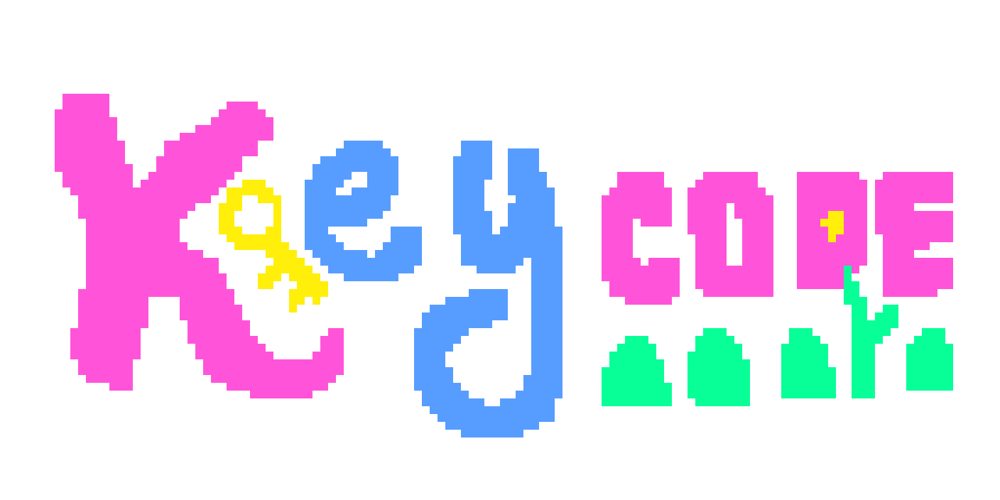
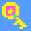
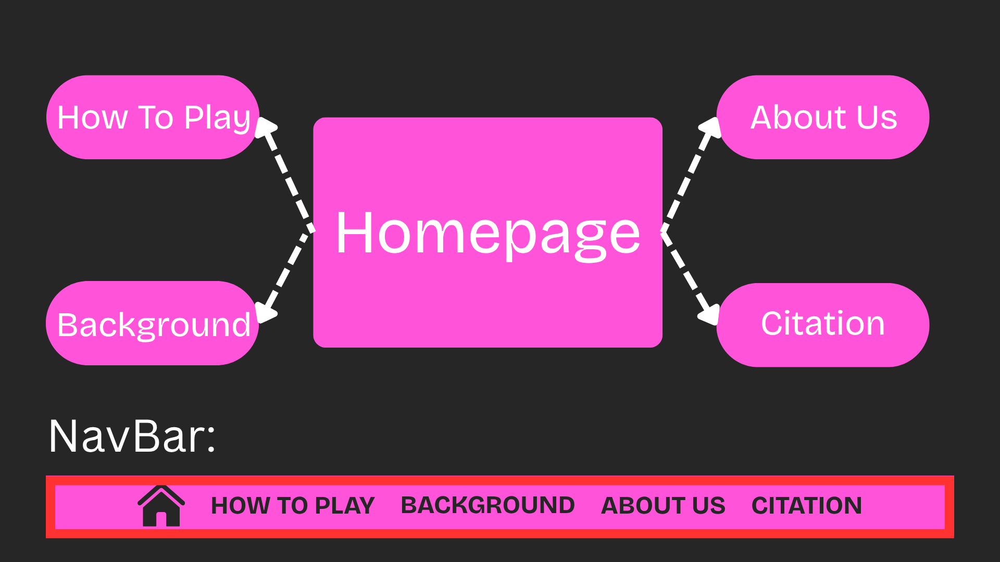
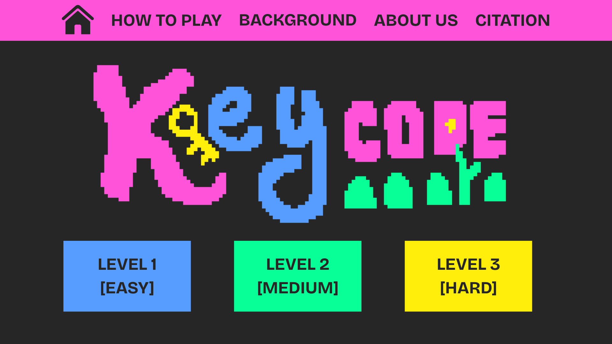
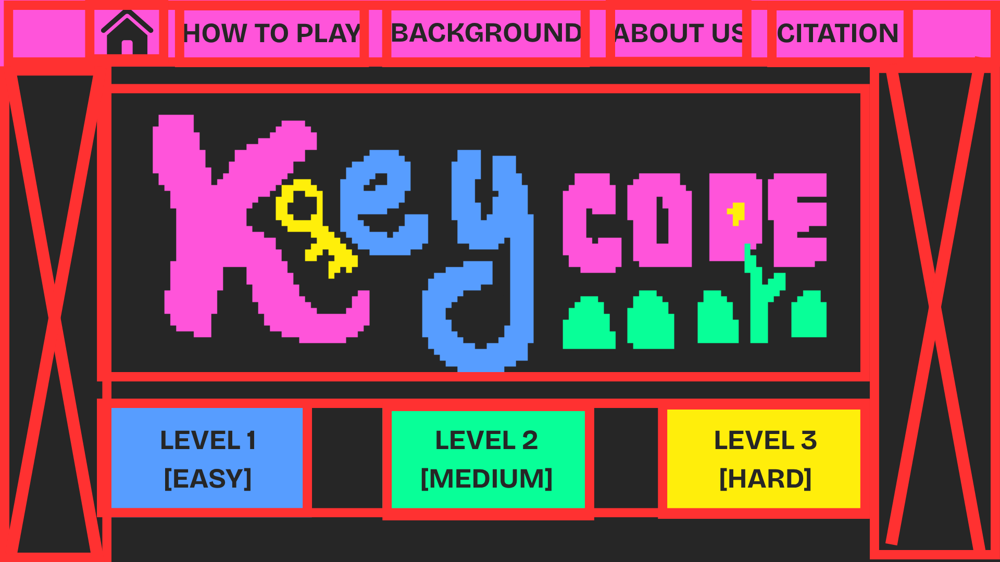
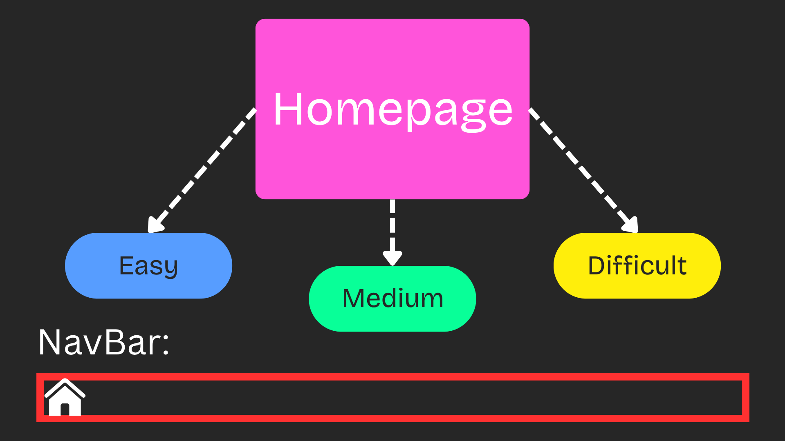

## Favicon: 

## Description: 
This webpage will have a simple in-browser game that will take the player on a journey in which the player must complete/type simple codes with missing elements that will allow them to progress on their journey. 

## Game Proper:
Each game level will have its own webpage. Every level will have ten codes that must be completed before a player can progress to the next level. It will be a simple side scrolling game that has a fantasy-adventure setting. A player’s end goal will be to locate a key and unlock the exit to progress.

> ## Application of JS
>JavaScript will be used for the in-browser game. It will be found in the game proper and will be used to move sprites, detect correct and incorrect inputs from players, and allow the player to progress to the next level upon completing one.

## Site Outline

### Home
The home page of the game will display the game’s title and a navigation bar that links to the other pages. Its background will showcase the game’s art, so that players will know what to expect.

> *LAYOUT*
> 
> 

### How to Play
This page will display a comprehensive set of rules and game mechanics. It will also include an embedded video tutorial on how to play the game.

### Background
This page will discuss how we were able to ideate and create the game using HTML, CSS and JS. It will also show the behind the scenes process of our codes, original ideas, and overall experience making this game.

### About Us
This page will introduce the users to us, the creators of the game. This will show our motivations and reflections upon making this game.

### Citations 
This page will show all of our references, images, videos, code snippets that we have used in this project. 

### Levels (Easy, Medium, Hard)
This showcases the different levels that the game has. There will be three levels of increasing difficulty. The player will be able to unlock the next level after completing the previous level.

